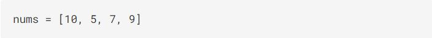
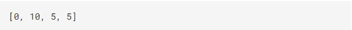

<h1><a href="https://binarysearch.com/problems/List-Min-Replacement">List Min Replacement</a></h1>

<>
Given a list of integers <code>nums</code>, replace every <code>nums[i]</code> with the smallest integer left of <code>i</code>. 
Replace <code>nums[0]</code> with <code>0</code>.
with <code>0</code>.

<h2>Constraints</h2>
<ul>
<li><code>n ≤ 100,000</code> where <code>n</code> is the length of <code>nums</code></li>
</ul>

 
<h3><b>Example 1</b></h3>

<h2><b>Input<b></h2>

 <h2><b>Output</b></h2>

<h3><b>Explanation</b></h3>
<ul>
<li><code>nums[0]=0</code></li>
<li><code>nums[1] = min(10)</code></li>
<li><code>nums[2] = min(5, 10)</code></li>
<li><code>nums[3] = min(7, 5, 10)</code></li>
</ul>

