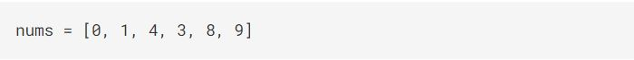
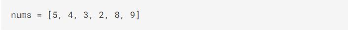
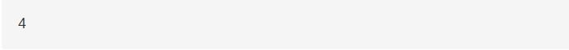
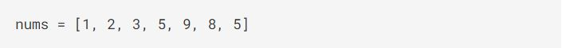

<h1><a href="https://binarysearch.com/problems/Shortest-Sublist-to-Sort">Shortest Sublist to Sortl</a></h1>

Given a list of integers <code>nums</code>, return the length of the shortest sublist in
<code>nums</code> which if sorted would make <code>nums</code> sorted in ascending order.
 
<h3><b>Example 1:</b></h3>

<h2><b>Input<b></h2>

 <h2><b>Output</b></h2>

<h3><b>Explanation</b></h3>

Sorting the sublist <code>[4, 3]</code> would get us <code>[0, 1, 3, 4, 8, 9]</code>

<h3><b>Example 2:</b></h3>

<h2><b>Input<b></h2>

 <h2><b>Output</b></h2>

<h3><b>Explanation</b></h3>

Sorting the sublist <code> [5, 4, 3, 2]</code> would get us <code> [2, 3, 4, 5, 8, 9]</code> 

<h3><b>Example 3:</b></h3>

<h2><b>Input<b></h2>

 <h2><b>Output</b></h2>

<h3><b>Explanation</b></h3>

Sorting the sublist <code>[9, 8, 5]</code> would get us <code>[1, 2, 3, 5, 5, 8, 9]</code> 
