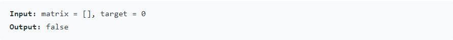

<h1><a href="https://leetcode.com/problems/search-a-2d-matrix/">Search a 2D Matrix</a></h1>

Write an efficient algorithm that searches for a value in an <code>m x n</code>matrix. This matrix has the following properties:

  <ul>
   <li>Integers in each row are sorted from left to right.</li>
   <li>The first integer of each row is greater than the last integer of the previous row.</li>
  </ul>

  <h3><b>Example 1:</b></h3>
  
<h3><b>Explanation 2:</b></h3>
 
 <h3><b>Explanation 3:</b></h3>
 

<h3><b>Constraints:</b></h3>:
<ul>
<li><code>m == matrix.length</code></li>
<li><code>n == matrix[i].length</code></li>
<li><code>0 <= m, n <= 100</code></li>
<li><code>-104<= matrix[i][j], target <= 104</code></li>
</ul>

